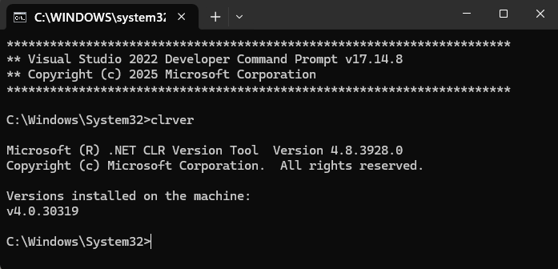
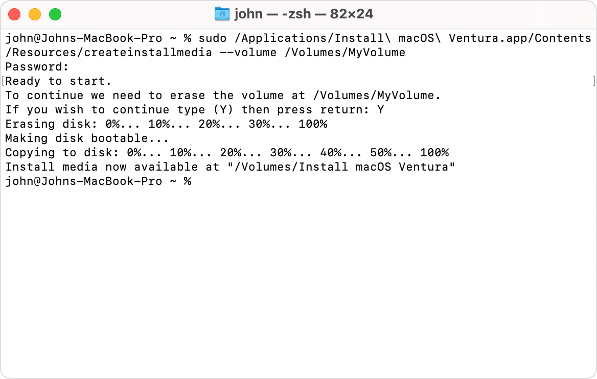
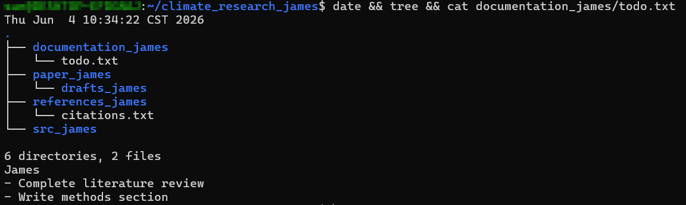

# How to use text user interface(TUI)

## 1. Purpose

Teach how to use the command line (text-based interface) on macOS/Linux (Unix) and Windows.




## 2. Essential Terminology (TUI Glossary)

Before using the Text User Interface (TUI), it is important to understand the key terms:

* **Directory (or Folder)**: A location in a file system used to store and organize files and other directories. In the command line, the term **directory** is more commonly used than "folder", but they refer to the exact same concept.
* **Parent Directory**: A directory that contains one or more other directories (subdirectories). For example, if a directory named `climate_research` contains a directory named `src`, then `climate_research` is the parent directory of `src`.
* **Child Directory (or Subdirectory)**: A directory located inside another directory. In the example above, `src` is the child directory (subdirectory) of `climate_research`.
* **Current Working Directory (or Active Directory)**: The directory you are currently "inside" in the terminal. Any file or directory commands you run without specifying a path will execute within this directory.
* **Home Directory**: The default personal directory assigned to a user account. It is where you start when you first open the terminal. (Represented by the tilde symbol `~` on macOS/Linux and `C:\Users\Username` on Windows).
* **Root Directory**: The top-most directory in a file system, from which all other directories branch out (represented by `/` on macOS/Linux and `C:\` on Windows).
* **Absolute Path**: The complete, exact path to a file or directory starting from the root directory (e.g., `/home/user/climate_research` or `C:\Users\user\climate_research`).
* **Relative Path**: The path to a file or directory relative to your current working directory (e.g., `src/main.py` or `../references`, where `..` refers to the parent directory).
* **Terminal / Command Prompt / Shell**: The text-based application interface (TUI) used to type and execute commands.


## 3. How to Open the Terminal / Command Prompt

Before you can run commands, you need to open your operating system's command line application:

### 3.1. macOS (Terminal)
* **Spotlight Search**: Press `Cmd + Space`, type `Terminal`, and press `Enter`.
* **Applications Folder**: Open Finder, go to `Applications` -> `Utilities`, and double-click **Terminal**.

### 3.2. Windows (Command Prompt)
* **Start Menu**: Press the `Windows key`, type `cmd` (or `Command Prompt`), and press `Enter`.
* **Run Dialog**: Press `Win + R`, type `cmd`, and press `Enter`.

### 3.3. Linux (Terminal)
* **Keyboard Shortcut**: Press `Ctrl + Alt + T` (works on Ubuntu and most other distributions).
* **Application Launcher**: Search for `Terminal` or `Console` in your desktop environment's application menu.

## 4. Common Command Line Operations (Quick Reference)

Below are quick reference tables comparing common commands for macOS/Linux (Bash/Zsh) and Windows (Command Prompt), organized by category.

### 4.1. Navigation (Moving Around)

| Action | macOS / Linux (Bash/Zsh) | Windows (Command Prompt) |
| :--- | :--- | :--- |
| **List files in a directory** | `ls` (or `ls -la`) | `dir` |
| **Print current working directory** | `pwd` | `cd` |
| **Move to a directory** | `cd directory_name` | `cd directory_name` |
| **Move to parent directory** | `cd ..` | `cd ..` |

### 4.2. Managing Directories (Subdirectories)

| Action | macOS / Linux (Bash/Zsh) | Windows (Command Prompt) |
| :--- | :--- | :--- |
| **Create a directory** | `mkdir directory_name` | `mkdir directory_name` |
| **Create a subdirectory** | `mkdir -p parent/subdirectory` | `mkdir parent\subdirectory` |
| **Copy a directory** | `cp -r source_dir dest_dir` | `xcopy /E /I source_dir dest_dir` |
| **Delete a directory** | `rm -rf directory_name` | `rmdir /s directory_name` |

### 4.3. Managing Files

| Action | macOS / Linux (Bash/Zsh) | Windows (Command Prompt) |
| :--- | :--- | :--- |
| **Create a text file** | `touch file.txt` | `type nul > file.txt` |
| **Create/Open file in GUI editor** | `touch file.txt && open -e file.txt` | `notepad file.txt` |
| **View file contents** | `cat file.txt` | `type file.txt` |
| **Rename a directory/file** | `mv old_name new_name` | `ren old_name new_name` |
| **Delete a text file** | `rm file.txt` | `del file.txt` |

### 4.4. Visualizing the Directory Structure

| Action | macOS / Linux (Bash/Zsh) | Windows (Command Prompt) |
| :--- | :--- | :--- |
| **Display a tree structure** | `tree` | `tree /F` |

---

## 5. Detailed Examples & Explanations

To follow along with these examples, first open your terminal/command prompt, create a practice directory named `terminal_practice`, and navigate into it:

* **macOS / Linux / Windows**:
  ```bash
  mkdir terminal_practice
  cd terminal_practice
  ```
  *(All subsequent examples assume your terminal is running inside the `terminal_practice` directory).*

### 5.1. Navigation (Moving Around)
* **List files and directories**:
  To see the list of contents in the current directory:
  * **macOS/Linux**:
    ```bash
    ls
    ```
    *(Note: Use `ls -la` to list all files, including hidden files and detailed info).*
  * **Windows (Cmd)**:
    ```cmd
    dir
    ```
  * **Interpreting the Output (Identifying Files vs. Directories)**:
    * **macOS/Linux (`ls -l` / `ls -la`)**:
      Look at the first character of the detailed output line:
      * `d` (e.g., `drwxr-xr-x`) indicates a **directory (folder)**.
      * `-` (e.g., `-rw-r--r--`) indicates a **file**.
      * `l` (e.g., `lrwxrwxrwx`) indicates a **symbolic link** (shortcut).
      *(Note: In many terminals, directories are also color-coded, e.g., in **blue**, while files are plain **white/black**).*

      **Example Output**:
      ```text
      drwxr-xr-x  2 user  group   4096 Jun  3 15:00 documentation
      -rw-r--r--  1 user  group   5522 Jun  3 15:05 todo.txt
      lrwxrwxrwx  1 user  group     12 Jun  3 15:06 shortcut -> original.txt
      ```
      *(Here, `documentation` is a directory, `todo.txt` is a file, and `shortcut` is a symbolic link).*

    * **Windows (`dir`)**:
      Look at the column preceding the name:
      * `<DIR>` indicates a **directory (folder)**.
      * A number (representing size in bytes, e.g., `5522`) indicates a **file**.

      **Example Output**:
      ```cmd
      06/03/2026  03:00 PM    <DIR>          documentation
      06/03/2026  03:05 PM             5,522 todo.txt
      ```
      *(Here, `documentation` is a directory, and `todo.txt` is a file with a size of 5,522 bytes).*
  * **How to Verify Execution**:
    Check the terminal output directly to ensure the files and directories are listed successfully without any error message (such as `No such file or directory` or `File Not Found`).

* **Print current working directory**:
  To check your current location in the directory system:
  * **macOS/Linux**:
    ```bash
    pwd
    ```
  * **Windows (Cmd)**:
    ```cmd
    cd
    ```
  * **How to Verify Execution**:
    Check the terminal output directly to confirm it displays the full absolute path of your current directory (which should end with `terminal_practice`).

* **Move into a directory**: 
  To enter a specific directory (for example, let's create a directory named `documentation` first, then navigate into it):
  * **First, create the directory**:
    ```bash
    mkdir documentation
    ```
  * **Then, enter the directory**:
    ```bash
    cd documentation
    ```
  * **How to Verify Execution**:
    Run the command to print your current location:
    * **macOS/Linux**:
      ```bash
      pwd
      ```
    * **Windows (Cmd)**:
      ```cmd
      cd
      ```
    *(Confirm that the output path now ends with `/terminal_practice/documentation` or `\terminal_practice\documentation`).*

* **Move to the parent directory**:
  To go up one level to the parent directory (returning to `terminal_practice`):
  ```bash
  cd ..
  ```
  * **How to Verify Execution**:
    Run the command to print your current location:
    * **macOS/Linux**:
      ```bash
      pwd
      ```
    * **Windows (Cmd)**:
      ```cmd
      cd
      ```
    *(Confirm that the output path has changed back to ending with `/terminal_practice` or `\terminal_practice`).*


### 5.2. Managing Directories (Subdirectories)
* **Create a directory**:
  Let's create a directory named `src`:
  ```bash
  mkdir src
  ```
  * **How to Verify Execution**:
    Run the list command to verify the directory was created:
    * **macOS/Linux**:
      ```bash
      ls
      ```
    * **Windows (Cmd)**:
      ```cmd
      dir
      ```
    *(Verify `src` is present in the output).*

* **Create a subdirectory**:
  To create a nested subdirectory structure (e.g., `paper/drafts`):
  * **macOS/Linux**: Use the `-p` flag to create intermediate directories if they don't exist:
    ```bash
    mkdir -p paper/drafts
    ```
  * **Windows**:
    ```cmd
    mkdir paper\drafts
    ```
  * **How to Verify Execution**:
    Run the list command for the parent directory:
    * **macOS/Linux**:
      ```bash
      ls paper
      ```
    * **Windows (Cmd)**:
      ```cmd
      dir paper
      ```
    *(Verify `drafts` is listed inside the `paper` directory).*

* **Copy a directory**:
  Let's copy the directory `src` (created earlier) to a new directory named `src_backup`:
  * **macOS/Linux**: Use the `cp` command with the recursive `-r` flag:
    ```bash
    cp -r src src_backup
    ```
  * **Windows (Cmd)**: Use the `xcopy` command with the `/E` and `/I` flags:
    ```cmd
    xcopy /E /I src src_backup
    ```
  * **How to Verify Execution**:
    Run the list command to verify the copied directory exists:
    * **macOS/Linux**:
      ```bash
      ls
      ```
    * **Windows (Cmd)**:
      ```cmd
      dir
      ```
    *(Verify both `src` and `src_backup` are present in the output).*

* **Rename a directory**:
  Let's rename the directory `documentation` (which we created in the navigation step) to `docs`:
  * **macOS/Linux**: Use `mv` (move/rename):
    ```bash
    mv documentation docs
    ```
  * **Windows (Cmd)**: Use `ren` (rename):
    ```cmd
    ren documentation docs
    ```
  * **How to Verify Execution**:
    Run the list command to verify the name change:
    * **macOS/Linux**:
      ```bash
      ls
      ```
    * **Windows (Cmd)**:
      ```cmd
      dir
      ```
    *(Verify the old directory `documentation` is gone and the new directory `docs` is present).*

### 5.3. Managing Files
* **Create an empty text file**:
  Let's create a file named `notes.txt` in the current directory:
  * **macOS/Linux**:
    ```bash
    touch notes.txt
    ```
  * **Windows (Cmd)**:
    ```cmd
    type nul > notes.txt
    ```
  * **How to Verify Execution**:
    Run the detailed list command to check file existence and size:
    * **macOS/Linux**:
      ```bash
      ls -l notes.txt
      ```
      *(Verify size is `0` bytes).*
    * **Windows (Cmd)**:
      ```cmd
      dir notes.txt
      ```
      *(Verify size is `0` bytes).*

* **Create/Open a file in a GUI text editor**:
  To create a new file or edit an existing one using your operating system's default graphical text editor:
  * **macOS**: Since the `open -e` command fails if the file does not exist, use `touch` to create it first (or combine them using `&&`):
    ```bash
    touch notes.txt && open -e notes.txt
    ```
  * **Windows (Cmd)**: Use the `notepad` command (opens in Notepad):
    ```cmd
    notepad notes.txt
    ```
    *(Note: If the file does not exist, Notepad will ask if you want to create a new file. Select **Yes**).*
  * **How to Verify Execution**:
    Verify that your system's text editor application opens up on your screen showing the file. After saving and closing the application, you can run `ls` or `dir` to verify that `notes.txt` exists.

* **View file contents**:
  To display the text content of a file (for example, let's view `notes.txt`):
  * **macOS/Linux**: Use the `cat` (concatenate and display) command:
    ```bash
    cat notes.txt
    ```
  * **Windows (Cmd)**: Use the `type` command:
    ```cmd
    type notes.txt
    ```
  * **How to Verify Execution**:
    Verify that the content of the file is printed in the terminal. If the file is empty, no text will be printed, but the command should run successfully without error messages (such as `No such file or directory` or `The system cannot find the file specified`).

* **Delete a file**:
  Let's delete the `notes.txt` file we just created:
  * **macOS/Linux**:
    ```bash
    rm notes.txt
    ```
  * **Windows (Cmd)**:
    ```cmd
    del notes.txt
    ```
  * **How to Verify Execution**:
    Run the list command to verify the file was removed:
    * **macOS/Linux**:
      ```bash
      ls notes.txt
      ```
      *(Should return an error like `No such file or directory` or not show the file).*
    * **Windows (Cmd)**:
      ```cmd
      dir notes.txt
      ```
      *(Should return `File Not Found`).*

### 5.4. Visualizing the Directory Structure
* **Display a tree structure**:
  To see a visual tree diagram of directories and files:
  * **macOS/Linux**:
    ```bash
    tree
    ```
    *(Note: If the `tree` command is not installed, you can install it via Homebrew with `brew install tree`, or use `find .` as a built-in alternative).*
  * **Windows (Cmd)**:
    ```cmd
    tree /F
    ```
    *(Note: The `/F` flag is required on Windows to show both directories and files; without it, only folders are listed).*
  * **How to Verify Execution**:
    Check the terminal output directly to verify that a tree-like hierarchy is drawn on your screen.

---

## 6. Student Evaluation: Real-World Scenario (Research Project Setup)

To evaluate if a student has successfully learned these commands, ask them to set up a clean, structured workspace for a scientific research project by performing the following step-by-step workflow:

### 6.1. Scenario: Setting up a Research Project Workspace
The student needs to organize a new research project. To prevent plagiarism, the root directory and all subdirectories must include the student's English name (represented as `[yourname]`, e.g., `james` for this example):
* Root directory: `climate_research_[yourname]` (e.g., `climate_research_james`)
* Subdirectories: `src_[yourname]`, `output_[yourname]`, `paper_[yourname]/drafts_[yourname]`, `references_[yourname]`, and `doc_[yourname]`.

Inside the `doc_[yourname]` directory, the student must create a `todo.txt` file where the first line is their name, followed by a simple task list (e.g., `- Complete literature review`, `- Write methods section`).

### 6.2. Step-by-Step Practical Assessment

1. **Open the Terminal / Command Prompt**:
   * Open the appropriate command-line application on your operating system (refer to the **How to Open the Terminal / Command Prompt** section above).

2. **Execute Workspace Setup Commands**:
   Type and execute the following commands in order:
   * **Initialize the Project Directory**:
     * Create a root directory named `climate_research_[yourname]` (e.g., `climate_research_james`).
     * Move into the `climate_research_[yourname]` directory.
   * **Create the Project Structure**:
     * Create a subdirectory named `src_[yourname]` (e.g., `src_james`).
     * Create a subdirectory named `output_[yourname]` (e.g., `output_james`).
     * Create a nested subdirectory structure `paper_[yourname]/drafts_[yourname]` (e.g., `paper_james/drafts_james`).
     * Create a subdirectory named `references_[yourname]` (e.g., `references_james`).
     * Create a subdirectory named `doc_[yourname]` (e.g., `doc_james`).
   * **Initialize Documentation & Bibliography**:
     * Inside the `doc_[yourname]` directory, create a text file named `todo.txt`. Write your name on the first line, followed by a simple task list (for example, by opening it with your GUI/CLI text editor or using echo redirection).
     * Inside the `references_[yourname]` directory, create a text file named `sources.txt`.

   * **Refactor and Rename**:
     * Rename the `doc_[yourname]` directory to `documentation_[yourname]` (e.g., `documentation_james`).
     * Rename the file `references_[yourname]/sources.txt` to `references_[yourname]/citations.txt`.
   * **Navigation and Cleanup**:
     * Navigate back up to the `climate_research_[yourname]` root directory.
     * Delete the `output_[yourname]` directory.

3. **Verify the Final Structure**:
   * While still inside the `climate_research_[yourname]` root directory, run a command to print the current date/time, the directory structure, and the content of your `todo.txt` file to prevent plagiarism:
     * **macOS/Linux**:
       ```bash
       date && tree && cat documentation_[yourname]/todo.txt
       ```
     * **Windows (Cmd)**:
       ```cmd
       echo %date% %time% && tree /F && type documentation_[yourname]\todo.txt
       ```

4. **Exit the Project Directory**:
   * Navigate back out of `climate_research_[yourname]` to its parent directory.

---

### 6.3. Deliverables
* **Directory Structure Screenshot**: Take a screenshot of the entire terminal window showing the execution of the verification command (`date && tree` or Windows equivalent). The screenshot must show your custom root directory name `climate_research_[yourname]` and all named subdirectories (e.g., `src_[yourname]`, `documentation_[yourname]`, etc.) along with the printed timestamp.

* **Submission**: Submit the screenshot to **iLearn** for grading.

### 6.4. Evaluation Criteria
* [ ] **Terminal Launch**: Student can open the terminal or command prompt correctly.
* [ ] **Navigation**: Student can move between nested directories without getting lost (`cd`, `cd ..`).
* [ ] **Pathing**: Student understands how to create nested directories with custom naming (e.g., using `mkdir -p` or Windows command equivalent).
* [ ] **File Management**: Student is able to create files inside specific directories and rename directories/files correctly.
* [ ] **Safety**: Student can safely delete files and empty or non-empty directories.
* [ ] **Verification**: Student is able to filter (grep) their terminal history to generate the verification report.
